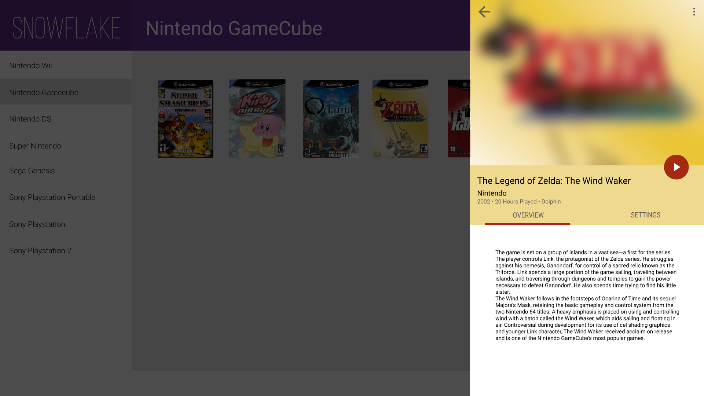

 
=========

<!---->
     
 

Snowflake provides a plugin-based backend and a set of APIs powering an modern HTML5 frontend for Emulators with unprecendented integration and easy of use, without needing to modify or recompile the base emulator; allowing for maximum compatibility.

Documentation
-------------
Preliminary documentation is available [here](http://snowflakepowe.red/doc/html/). As we document out API, we'll also be writing quick start guides on creating plugins.

Contributing
------------
Please feel free to explore the current API, please be aware that Snowflake is still pre-release software and may change at any time. We're also in need of code coverage so if you have some free time, feel free to write some unit tests for Snowflake. Remember to read the contribution guildelines before filing a pull request.

What's Possible?
----------------
Anything that's possible to do in HTML5 will be possible on Snowflake. Including Material Design (coming soon)

I don't code, what can I do with Snowflake?
-------------------------------------------
Nothing yet, hang on while we get our API stable and start to write the UI!

Legal
-----
Snowflake is licensed under the Apache License 2.0. However any fork of the [codebase prior to the relicensing to Apache 2](https://github.com/snowflake-frontend/snowflake/commit/b0286553ec0887ce406420827a2ba0c20aa78117#diff-d41d8cd98f00b204e9800998ecf8427e) must be distributed under the GNU GPL v3. Any fork of the codebase after that commit is can be distributed under the Apache 2 license. Snowflake does not in any way facilitate the download of illegal ROM images or warez of any kind. 
