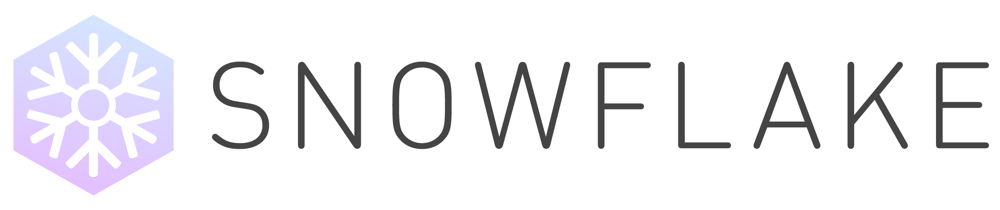

 
=========

**Build Status**

| Windows | Linux |  |  | |  |
| ---------------------------------------- | ---------------------------------------- | ---------------------------------------- | ---------------------------------------- |---------------------------------------- | -------------------------------------------------- | 
| [](https://dev.azure.com/SnowflakePowered/snowflake/_build?definitionId=1) | [](https://dev.azure.com/SnowflakePowered/snowflake/_build?definitionId=2) | [](https://codecov.io/gh/SnowflakePowered/snowflake) | [](https://www.codefactor.io/repository/github/snowflakepowered/snowflake) | [](https://lgtm.com/projects/g/SnowflakePowered/snowflake/alerts/) | [](https://github.com/SnowflakePowered/snowflake/blob/master/LICENSE) |


**Latest Version**

|  |  |
| ---------------------------------------- | ---------------------------------------- |
| [](https://www.myget.org/gallery/snowflake-nightly) | [](https://www.nuget.org/packages/Snowflake.Framework) |


Snowflake is a framework for building flexible and beautiful emulator frontends. With features such as advanced configuration generation and an intelligent scraping system, Snowflake provides a powerful set of tools to manage, play, and organize your games when designing your dream frontend using the language of your choice.


Features
--------
Snowflake features innovative solutions to many problems with current emulator frontends.
* Full cross-patform support through .NET Core.
* Dynamic and flexible tree-based game scraping.
* Programmatic per-game emulator configuration generation and input management.
* Multi-disc and multi-file capable relational games database.

At its core, Snowflake is designed to be moddable and easy to develop for, with a comprehensive C# API for extensibility and GraphQL interface for frontend UIs.
* Language-agnostic GraphQL interface for communicating with the Snowflake framework.
* Plugin API to extend the framework with C# plugins.
* Module-based runtime extensibility.
* [Stone](https://github.com/SnowflakePowered/stone) platform, controller, and canonical ROM file mimetype compliant.
* Dedicated CLI to help you get started quickly and easily. 

Star this repository and bookmark our [website at http://snowflakepowe.red](http://snowflakepowe.red/) to keep up with Snowflake's development. We'll have something new in store for you soon!

Getting Started
---------------

Snowflake does not currently have a well defined install process for end-users, but it is easy to set up a development environment. 
You will need the [.NET 5 SDK](https://www.microsoft.com/net/download/) to get started. 

```cli
$ git clone --recursive https://github.com/SnowflakePowered/snowflake/
$ cd snowflake
$ dotnet run --project build -- Bootstrap
```

This command will build and install all support modules required for Snowflake to be functional to your application data directory (`%appdata%\snowflake\modules` or `~/.snowflake/snowflake/modules` on Linux). Note that you may have to delete the installed module `assembly.Snowflake.Framework.Test.InvalidComposable`, which is designed deliberately to error on load, however this is not necessary.

As well, input management APIs are currently only available on Windows. Attempting to use these APIs on Linux will fail to enumerate any device.

Legal
-----
Snowflake is licensed under the Mozilla Public License 2.0 (MPL2). Since May 1, 2016, this license is retroactively applied to all prior copies of Snowflake's source code which may have been licensed under different terms. 

Snowflake does not in any way facilitate the download of illegal ROM images or warez of any kind. 
